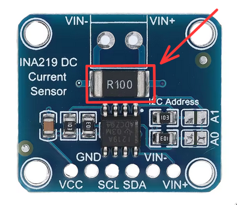
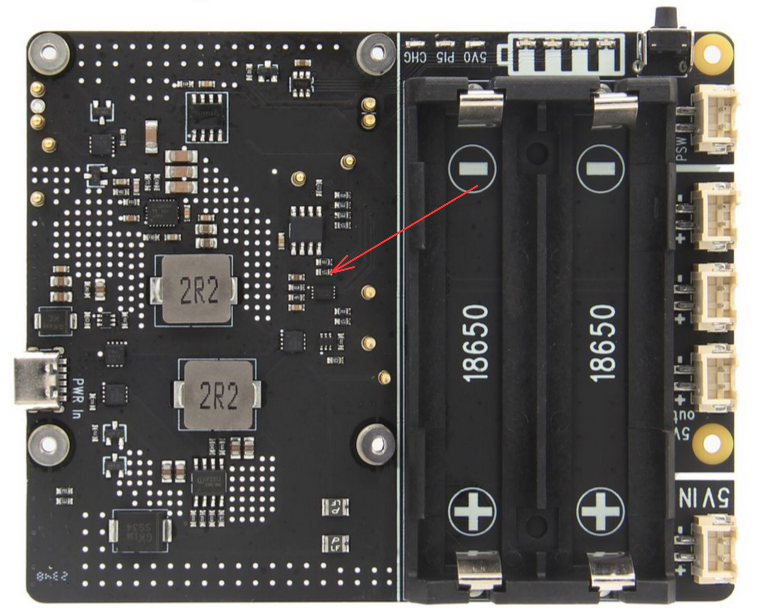

# Wiring

---

## Definitions
- `B` = LiFePo4 (12.8V)
- `12v_busbar` = 8-pin red busbar
- `main_GND_busbar` = 8-pin blue busbar
- `low_current_GND_busbar` = (both) 15-pin blue busbar
- `SDA_busbar` = 10-pin yellow busbar
- `SCL_busbar` = 10-pin green busbar
- `buck` = XL4015 Buck Converter 0.8-30V to 5-32V
- `HAT` = geekworm X1201 power hat
- `5v_busbar` = busbar 15pin red (#1)
- `3.3v_busbar` = busbar 15pin red (#2)
- `capacitor` = Capacitor 2200uF 63v
- `shunt` = shunt resistor 50A 75mV

---

## Mechanical Installation

- Install geekworm H505 cooler on RPi5
- Install 2x Li-ion 18650 batteries in `HAT`
- Mount RPi5 on `HAT`

> Refer to official Geekworm documentation for detailed steps.

---

## Power
- `B`+ -> battery disconnect -> `shunt` -> `12v_busbar`
- `B`- -> `main_GND_busbar`
- `low_current_GND_busbar` -> `main_GND_busbar`
- `capacitor`+ -> `12v_busbar`
- `capacitor`- -> `main_GND_busbar`
- `buck` IN+ -> `12v_busbar`
- `buck` IN- -> `main_GND_busbar`
> Set `buck` output voltage to **5V** before connecting to `HAT`.

- `HAT` 5V IN+ -> `buck` OUT+, 5V IN- -> `low_current_GND_busbar` (via JST XH2.54)
- RPi5 5v (Pin 2) -> `5v_busbar`
- RPi5 3.3v (Pin 1) -> `3.3v_busbar`

> All GND busbars are electrically common and ultimately connected to battery `B-`.
> Multiple GND busbars are used only for wiring organization and separation of high-current and low-current devices.

---

## Motors

### Right side (BTS7960 #1)
- BTS7960 B+ -> `12v_busbar`
- BTS7960 B- -> `main_GND_busbar`
- BTS7960 VCC -> `5v_busbar`
- BTS7960 GND -> `low_current_GND_busbar`
- BTS7960 R_EN / L_EN -> `3.3v_busbar`
- BTS7960 RPWM -> GPIO 12 *(hw pwm channel 0)*
- BTS7960 LPWM -> GPIO 13 *(hw pwm channel 1)*
- back motor M+ -> BTS7960 M-
- back motor M- -> BTS7960 M+
- front motor M+ -> BTS7960 M+
- front motor M- -> BTS7960 M-
- back motor encoder+ -> `3.3v_busbar`
- back motor encoder- -> `low_current_GND_busbar`
- back motor encoder A signal -> GPIO 23

### Left side (BTS7960 #2)
- BTS7960 B+ -> `12v_busbar`
- BTS7960 B- -> `main_GND_busbar`
- BTS7960 VCC -> `5v_busbar`
- BTS7960 GND -> `low_current_GND_busbar`
- BTS7960 R_EN / L_EN -> `3.3v_busbar`
- BTS7960 RPWM -> GPIO 18 *(hw pwm channel 2)*
- BTS7960 LPWM -> GPIO 19 *(hw pwm channel 3)*
- back motor M+ -> BTS7960 M+
- back motor M- -> BTS7960 M-
- front motor M+ -> BTS7960 M+
- front motor M- -> BTS7960 M-
- back motor encoder+ -> `3.3v_busbar`
- back motor encoder- -> `low_current_GND_busbar`
- back motor encoder A signal -> GPIO 24

> Motor wiring and polarity are intentionally arranged to ensure consistent directional mapping:
> **RPWM = forward**, **LPWM = backward**.

---

## I2C
- `SDA_busbar` -> GPIO 2
- `SCL_busbar` -> GPIO 3

---

### INA219
- VCC -> `3.3v_busbar`
- GND -> `low_current_GND_busbar`
- SDA -> `SDA_busbar`
- SCL -> `SCL_busbar`
- VIN+ -> `shunt` battery side
- VIN- -> `shunt` load side

---

### MPU6050
- VCC -> `3.3v_busbar`
- GND -> `low_current_GND_busbar`
- SDA -> `SDA_busbar`
- SCL -> `SCL_busbar`

---

## Other

- Push Button+ -> `5v_busbar`
- Push Button- -> `low_current_GND_busbar`
- Push Button signal wires (green & white wires) -> `HAT` PSW (via JST XH2.54)

> makes external `HAT` power button

---

## GPIO Summary

| GPIO    | Function        |
| ------- | --------------- |
| GPIO 12 | Right RPWM      |
| GPIO 13 | Right LPWM      |
| GPIO 18 | Left RPWM       |
| GPIO 19 | Left LPWM       |
| GPIO 23 | Right Encoder A |
| GPIO 24 | Left Encoder A  |
| GPIO 2  | `SDA_busbar`    |
| GPIO 3  | `SCL_busbar`    |

---

## Hardware Modifications

### INA219 Module

The onboard `R100` shunt resistor was removed from the INA219 module using soldering tools to allow the use of an external high-current shunt resistor.

This modification enables accurate measurement of significantly higher currents using the external `50A 75mV` shunt resistor connected to `VIN+` and `VIN-`.

---

### X1201 HAT

A resistor responsible for the automatic power-on feature was removed from the X1201 HAT.

This disables automatic startup when external power or charging power is connected. The Raspberry Pi 5 can now only be powered on using either the onboard button or the external button connected to the `PSW` header.

This behavior is intentional for the project design. The battery disconnect is intended to completely cut power only, without automatically booting the Raspberry Pi again when switched back on.

---
